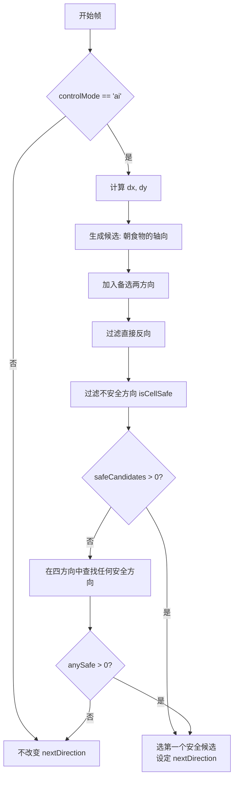
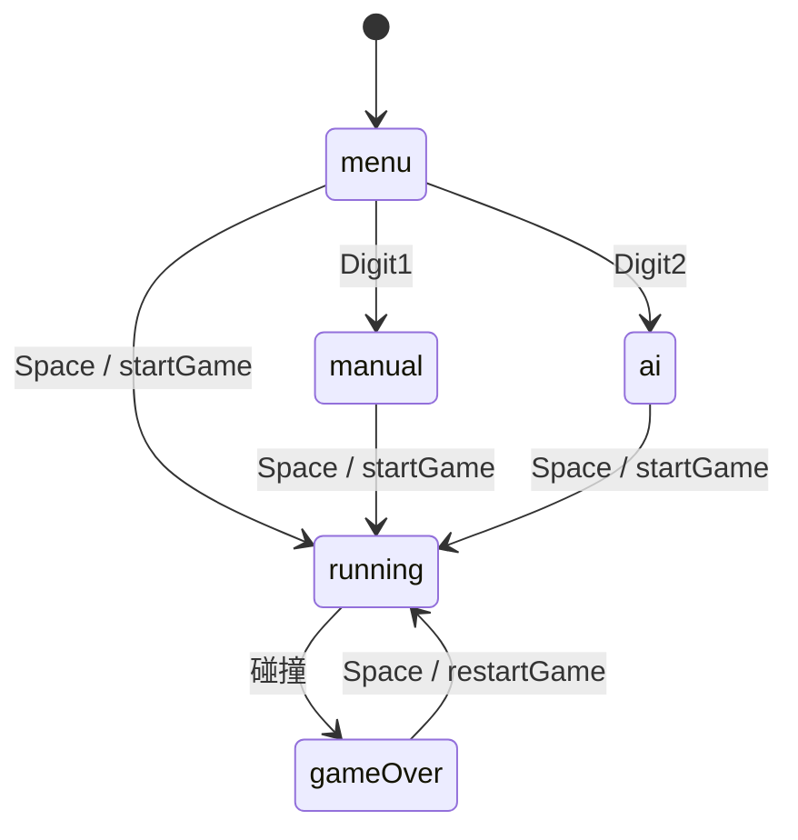

# 贪吃蛇 AI 算法解释与改进建议

> 文件位置：`docs/snake-ai.md`

## 核心结构
- 决策入口：在`gameLoop`中每个步长调用`computeAIDirection()`以更新下一方向（`index.html:175-183`）。
- 贪心决策：`computeAIDirection()`根据食物相对位置生成候选方向，过滤反向与不安全方向，选择第一个安全候选；若无则在四个基本方向中选任意安全方向（`index.html:386-412`）。
- 安全判断：`isCellSafe(nx, ny)`判断目标格是否越界或与身体重叠（`index.html:415-423`）。
- 资源生成：`placeFood()`将食物集中到画布中央的指定百分比区域，中央区域过满时回退到全图（`index.html:196-218`）。
- 模式切换：菜单/人工/AI 三态；按`1`切人工、按`2`切AI，空格开始（`index.html:374-383`, `index.html:432-461`）。

## AI 决策流程（Mermaid）

说明：当没有安全候选时，不更新`nextDirection`，蛇继续按上一帧的方向移动。

## 模式状态机（Mermaid）

UI 标签：顶部显示当前模式（`index.html:381-383`）；运行中不允许切换，避免误操作（`index.html:375-380`）。

## 资源生成算法（中央集中）
- 百分比区域：水平`30%–70%`，垂直`40%–60%`，可在`config.resourceArea`修改（`index.html:85-88`）。
- 放置流程：在中央区域采样，若采样超过 100 次仍碰撞，则回退到全图采样，确保始终可生成（`index.html:203-218`）。

## 卡死问题分析（吃到约 20 次后自锁）
1. 局部贪心缺乏全局路径规划：仅根据食物方向选下一步，随着身体增长，容易在中心高密度区域形成闭环，头部被身体包围后无安全方向（见`computeAIDirection`流程）。
2. 候选排序未评估“空域”：优先直线靠近食物，可能钻入窄走廊或角落，短期安全但长期导致可达空间缩小，最终无路可走。
3. 集中资源分布的副作用：中央区域生成提高吃到食物的频率，同时也让蛇在中心不断盘旋，更容易构造自锁形状（圆环/回形针）。

## 三个简单有效的优化选项

### 选项 A：尾部可达性优先（Tail-aware Greedy）
- 思路：对每个候选方向，模拟走一步后检查“新头”到“当前尾”的可达性（尾在下一帧会移动）。若不可达则避免该候选，优先选择保持与尾连通的方向。
- 实现要点：
  - 轻量 BFS/泛洪填充（Flood Fill）在网格上计算连通性；限制最大探索格数以控制性能。
  - 只需判断“是否连通”，不要求找到到食物的路径。
- 效果：显著降低自锁概率，兼容现有结构（在`computeAIDirection`中插入可达性过滤即可）。

#### 已集成的实现细节
- 新增配置：`config.ai.enableTailReachability`、`config.ai.maxFloodCells`（`/Users/lihui/Documents/demo/index.html:82-100`附近）。
- 决策增强：在安全候选上再调用`isTailReachableFrom(newHead, wouldEat)`进行尾部可达性过滤（`/Users/lihui/Documents/demo/index.html:392-412`附近）。
- 泛洪函数：`isTailReachableFrom(newHead, wouldEat)`使用有限 BFS，若本步不吃食物则将尾格视为可通行（尾将移动），否则视为占用（`/Users/lihui/Documents/demo/index.html:414-447`附近）。
- 行为：若存在通过可达性过滤的候选则优先使用；否则回退到仅“安全”候选或全局四方向的安全回退。

### 选项 B：最大空域启发式（Open-space Heuristic）
- 思路：对每个安全候选，估算从新头出发可到达的自由格数量（简化 Flood Fill，设上限例如 200 格），选择拥有最大空域的方向。
- 实现要点：
  - 使用队列或栈做有限泛洪，遇到身体或边界停止。
  - 作为贪心靠近食物的次级规则：若两个候选都能靠近食物，选空域更大的那个。
- 效果：避免进入狭窄通道与角落，减少长期自锁。

### 选项 C：环路巡航备份（Hamiltonian Cycle Fallback）
- 思路：预定义一条覆盖全图的“蛇形环路”（如沿边框蛇形遍历）。当无安全候选或检测到自锁风险时，切换到环路模式沿固定路径移动；靠近食物时再暂时脱离环路吃食物。
- 实现要点：
  - 生成一个遍历序列（按格子坐标形成闭环）；根据当前头部位置找到环路上的下一格。
  - 作为后备策略，仅在高风险时介入，平时仍保持贪心以加快吃食物。
- 效果：理论上可做到“永不死”（除非环路被误打破），非常稳定；实现复杂度中等，但对现有结构侵入性较低。

---

## 与现有系统的兼容建议
- 保持`computeAIDirection()`接口不变，将新策略作为候选过滤或后备决策插入，避免影响人工模式与渲染逻辑。
- 所有新参数挂到`config`下，例如：
  - `ai.maxFloodCells`、`ai.enableTailReachability`、（可扩展）`ai.enableOpenSpaceHeuristic`、`ai.enableCycleFallback`。
- 测试建议：
  - 固定随机种子（或记录食物序列）以复现场景。
  - 分别在空域稀疏与中央密集两类地图下跑 100 次统计平均存活长度与卡死率。

## 关键代码引用
- 决策入口：`/Users/lihui/Documents/demo/index.html:175-183`
- 贪心决策：`/Users/lihui/Documents/demo/index.html:386-412`
- 安全判断：`/Users/lihui/Documents/demo/index.html:415-423`
- 资源生成：`/Users/lihui/Documents/demo/index.html:196-218`
- 模式切换：`/Users/lihui/Documents/demo/index.html:374-383`, `432-461`
